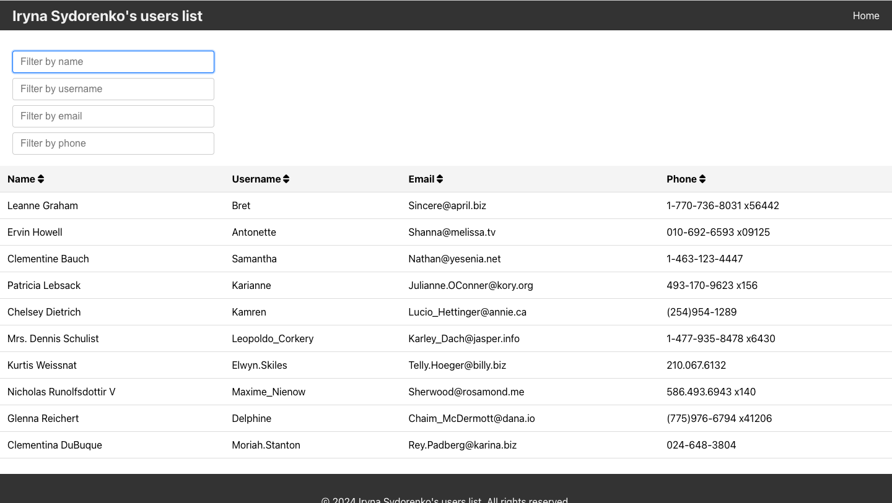
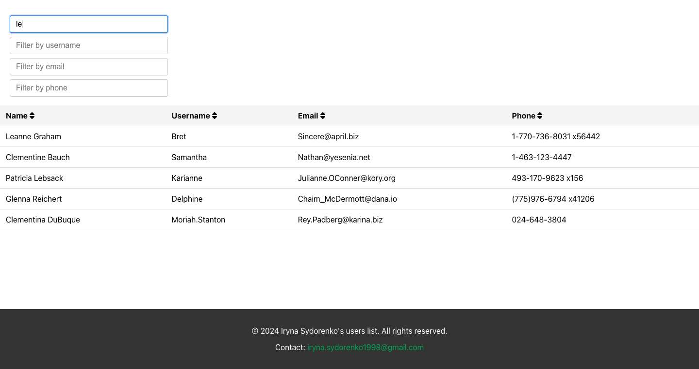

# User Management System





This React application is a User Management System designed in React, Redux, and TypeScript. It showcases a user management table that displays user information fetched from a mock API, along with advanced filtering capabilities.

## Objective

The goal of this project is to evaluate the ability to create a React application that uses Redux for state management and TypeScript for type safety. The application includes a user management table that provides dynamic filtering of user data based on various criteria.

## Features

- **User Management Table**: Displays user information such as name, username, email, and phone. Data is fetched from the JSONPlaceholder mock API.
- **Advanced Filtering**: Allows dynamic filtering of the table by name, username, email, and phone. Filters update the displayed results in real time as the user types.
- **State Management**: Utilizes Redux (with the option of using Redux Toolkit) to manage the state of the user data and filtering criteria.
- **Type Safety**: Implements TypeScript to ensure type safety across the application, reducing potential runtime errors and enhancing code quality.

## Technologies Used

- **React**: A JavaScript library for building user interfaces.
- **Redux/Redux Toolkit**: State management libraries designed to handle the state of React applications in a predictable way.
- **TypeScript**: A superset of JavaScript that adds static types.
- **SCSS**: Used for writing more maintainable stylesheets.

## Setup and Installation

```bash
# 1. Clone the repository
git clone https://your-repository-url.git

# 2. Navigate to the project directory
cd user-management-system

# 3. Install dependencies
npm install

# 4. Start the development server
npm start

```
